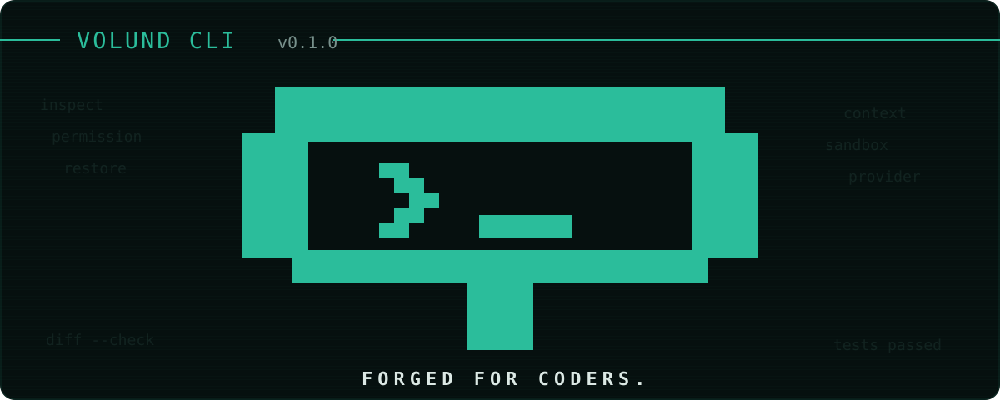

<p align="center">
  
</p>

<p align="center">
  <strong>Open-source coding infrastructure for developers who want agentic speed without giving up control.</strong>
</p>

<p align="center">
  <a href="#quick-start"><strong>Quick start</strong></a> ·
  <a href="apps/docs/index.md"><strong>Documentation</strong></a> ·
  <a href="README.zh-CN.md"><strong>简体中文</strong></a>
</p>

<p align="center">
  <a href="LICENSE"></a>
  
  
  <a href="CONTRIBUTING.md"></a>
  
</p>

Volund CLI brings an agentic coding loop to the command line while keeping trust, permissions, credentials, and sandbox state visible. It is designed around explicit provider boundaries, recoverable file changes, machine-readable output, and native isolation helpers.

> [!IMPORTANT]
> Volund CLI is in active early development. A stable npm release has not been published; install it from source for evaluation and development. Interfaces and behavior may change before the first stable release.

## Table of contents

- [Table of contents](#table-of-contents)
- [Why Volund CLI](#why-volund-cli)
- [What works today](#what-works-today)
- [Quick start](#quick-start)
  - [Prerequisites](#prerequisites)
  - [Build from source](#build-from-source)
  - [Start your first session](#start-your-first-session)
- [Usage](#usage)
- [Configuration and security](#configuration-and-security)
- [How it fits together](#how-it-fits-together)
- [Development](#development)
- [Roadmap and project status](#roadmap-and-project-status)
- [Contributing and support](#contributing-and-support)
- [License](#license)

## Why Volund CLI

| Control by default                                                                          | Built for real workflows                                                               | Open at every layer                                                                           |
|---------------------------------------------------------------------------------------------|----------------------------------------------------------------------------------------|-----------------------------------------------------------------------------------------------|
| **Explicit trust**<br>Resolve directory trust before any provider, tool, or session starts. | **Recoverable sessions**<br>Resume durable turns and preview guarded file restoration. | **Provider-neutral core**<br>Keep adapters and routing outside the agent loop.                |
| **Granular permissions**<br>Approve writes, commands, and network access independently.     | **Native isolation**<br>Use Rust-powered sandbox, search, and filesystem helpers.      | **Composable runtime**<br>Extend through namespaced plugins, skills, tools, and MCP.          |
| **Visible security state**<br>Inspect credentials, sandbox tier, trust, and runtime health. | **Automation-ready**<br>Stream versioned NDJSON without ANSI or TUI frames.            | **Inspectable architecture**<br>Follow boundaries across TypeScript packages and Rust crates. |

## What works today

The current CLI includes:

- interactive Ink TUI and line-mode chat;
- one-shot prompts and NDJSON output for scripts;
- directory trust rules and project-configuration approval;
- provider credential login/logout with secure storage;
- permission checks, native sandbox integration, and runtime diagnostics;
- session history, resume, and guarded restore flows;
- contained plugin management: list, diagnose, disable, and uninstall remain available, while
  legacy install/enable/activation temporarily fail closed pending Catalog v2 and the verified ABI;
- local telemetry inspection, redacted export, and clearing;
- configurable provider/model routing, including role-based candidates.

See the [CLI reference](apps/docs/docs/reference/cli.md) for the authoritative command surface and the [security model](apps/docs/docs/concepts/security-model.md) before using Volund on sensitive repositories.

## Quick start

### Prerequisites

- Node.js 20.19 or newer
- pnpm 11.10.0 (declared through Corepack)
- Rust 1.71 or newer when building the native crates locally

### Build from source

```bash
git clone https://github.com/JS-mark/volund-code.git
cd volund-code
corepack enable
pnpm install --frozen-lockfile
pnpm build
node apps/cli/dist/volund.js --help
```

The source bundle keeps the legacy `dist/volund.js` filename during the compatibility window. The canonical npm package is `volund-cli`, with platform packages under `@volund/*`; it exposes `volund` as the canonical command and retains `volund` as an alias. The legacy `volund-code` package is generated only as a compatibility meta package.

The workspace package version is currently `0.0.0`; it is not a published release. Follow the [installation guide](apps/docs/docs/getting-started/install.md) for release and native-binary details.

### Start your first session

```bash
node apps/cli/dist/volund.js chat
```

On first use in a directory, Volund asks you to trust the canonical workspace path before initializing the runtime. Choose Anthropic during onboarding and enter the credential only in Volund's masked prompt, or authenticate explicitly:

```bash
node apps/cli/dist/volund.js login anthropic
node apps/cli/dist/volund.js doctor --strict
```

Read the [first-run guide](apps/docs/docs/getting-started/first-run.md) for trust scopes, headless behavior, and sandbox checks.

## Usage

Interactive chat is the default when stdin and stdout are terminals:

```bash
node apps/cli/dist/volund.js
node apps/cli/dist/volund.js chat
```

Force the line-mode fallback:

```bash
node apps/cli/dist/volund.js chat --no-tui
```

Run a one-shot prompt and emit NDJSON without ANSI frames:

```bash
node apps/cli/dist/volund.js chat "summarize this repository" --json
```

Inspect runtime state or manage a previous session:

```bash
node apps/cli/dist/volund.js status --json
node apps/cli/dist/volund.js history list
node apps/cli/dist/volund.js resume <session-id>
node apps/cli/dist/volund.js restore <session-id> --dry-run
```

Save durable project knowledge and pin selected memories into future prompts:

```bash
node apps/cli/dist/volund.js memory add --id package-manager --tag tooling --content "Use pnpm"
node apps/cli/dist/volund.js memory pin package-manager
node apps/cli/dist/volund.js memory list --scope project --pinned --json
```

Pinned memories are bounded and injected as untrusted advisory data. Current user and system instructions always take precedence. Use `memory unpin` or `memory delete --yes` to stop future injection.

Use `volund help` or the [CLI reference](apps/docs/docs/reference/cli.md) for all commands. The [JSON output reference](apps/docs/docs/reference/json-output.md) documents the automation contract.

## Configuration and security

> [!NOTE]
> Phase A changes the user-facing brand and command first. The npm graph now uses `volund-cli` / `@volund/*`, with `volund-code` retained as a compatibility meta package. Existing local data, environment variables, and machine-readable schema identifiers remain compatibility surfaces in this release line.

User configuration lives in `~/.volund/config.toml`. Configuration layers are applied in this order: built-in defaults, global configuration, approved project configuration, environment values, then CLI flags. Project configuration is not loaded in non-interactive runs unless you pass `--trust-project-config`; sensitive routing, authentication, endpoint, and telemetry-sink keys are rejected from project configuration.

Example role routing in the trusted global configuration:

```toml
[router]
type = "role"

[router.default]
provider = "anthropic"
model = "claude-sonnet-4-5"

[router.roles.coder]
provider = "anthropic"
model = "claude-sonnet-4-5"
priority = 100
```

Security-relevant behavior:

- directory trust does not grant write, command, or network permission;
- headless runs fail on untrusted directories unless `--trust-workspace` is supplied explicitly;
- credentials are stored in the OS keychain or encrypted fallback store, not project files;
- `--dangerously-no-sandbox` requires explicit risk confirmation and is unsuitable for release acceptance;
- telemetry stays local unless an exporter is explicitly configured.

For details, see [directory trust and first run](apps/docs/docs/getting-started/first-run.md), the [security model](apps/docs/docs/concepts/security-model.md), and [sandbox troubleshooting](apps/docs/docs/troubleshooting/sandbox.md).

## How it fits together

```text
Terminal / automation
        │
        ▼
  apps/cli ──────── interactive UI, commands, JSON output
        │
        ▼
 packages/kernel ── Cordis Context tree: model/tools/bus/session/sandbox/ui services
   │      │      │
   │      │      └── tools, permissions, context, storage
   │      └───────── provider router and provider adapters
   └──────────────── plugin, skill, and MCP runtimes (plugin-contributed tools,
                     hooks, and prompts register into the same kernel services)
        │
        ▼
 crates/* ───────── native sandbox, search, and filesystem helpers
```

The TypeScript packages keep the agent loop, providers, tools, permissions, storage, UI, plugins, and native bridge separated; `packages/kernel` is the runtime spine where first-party subsystems and third-party plugin contributions meet under one service tree (plugins always execute inside the Rust sandbox, never in-process). The Rust workspace contains `volund-sandbox`, `volund-search`, and `volund-fs`. For the detailed design, read the [architecture specification](docs/superpowers/specs/2026-07-31-volund-code-design/README.md).

## Development

Install dependencies and run the standard local checks:

```bash
corepack enable
pnpm install --frozen-lockfile
cargo test --workspace
pnpm typecheck
pnpm test
pnpm build
pnpm format:check
```

Build optimized native binaries with `cargo build --workspace --release`. For local native diagnostics, build the Rust workspace and point Volund to the three binaries:

```bash
cargo build --workspace
pnpm --filter volund-cli build
VOLUND_NATIVE_SANDBOX_BINARY="$PWD/target/debug/volund-sandbox" \
VOLUND_NATIVE_SEARCH_BINARY="$PWD/target/debug/volund-search" \
VOLUND_NATIVE_FS_BINARY="$PWD/target/debug/volund-fs" \
node apps/cli/dist/volund.js doctor --strict
```

An unavailable Anthropic credential can still make strict diagnostics fail after the native binaries build successfully. See [authentication troubleshooting](apps/docs/docs/troubleshooting/auth.md).

## Roadmap and project status

Volund CLI is progressing through repository-defined capability levels. The current public package is not released, and some future-facing design documents describe work beyond the shipped CLI. The implementation and tests are the source of truth.

Current planning and evidence are maintained in:

- the [milestone specification](docs/superpowers/specs/2026-07-31-volund-code-design/10-milestones.md);
- [release readiness evidence](docs/releases/);
- the [capability traceability document](docs/superpowers/specs/2026-07-31-volund-code-design/16-capability-traceability.md).

Plugins are first-class runtime extensions: sandboxed plugins contribute tools, hooks, prompt fragments, and session-event subscriptions into the kernel service tree, and the built-in tool set ships as three first-party domains (`volund.core-tools`, `volund.exec`, `volund.orchestration`) that are visible and toggleable via `/plugins` or `volund plugins builtin --enable/--disable <id>`. Notably, registry/GitHub plugin installation, plugin upgrades, and the L4 development hot-reload command are not implemented yet.

## Contributing and support

Contributions are welcome. Start with [CONTRIBUTING.md](CONTRIBUTING.md), follow the [Code of Conduct](CODE_OF_CONDUCT.md), and review [SECURITY.md](SECURITY.md) before reporting a vulnerability.

- Use [GitHub Issues](https://github.com/JS-mark/volund-code/issues) for reproducible bugs and approved work.
- Use [GitHub Discussions](https://github.com/JS-mark/volund-code/discussions) for questions and ideas, if Discussions is enabled for the repository.
- Follow the RFC process in the contribution guide for architecture, security, providers, or public API changes.

## License

Volund CLI is licensed under the [Apache License 2.0](LICENSE).
