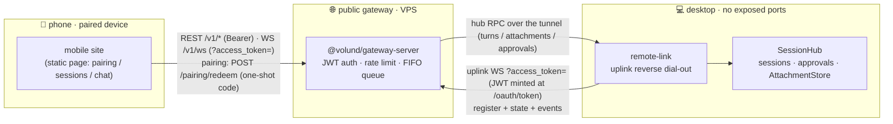

# Remote gateway (relay)

The remote gateway is a standalone public relay process (`@volund/gateway-server`,
**not a volund CLI subcommand**): the desktop volund (TUI/Web console) dials out to
`/uplink` and registers itself, and mobile or machine clients are routed through the
gateway to the **local** session (topology: phone → gateway(VPS) → uplink tunnel →
local machine). Public instance: `https://gateway.ai-agentic.cc`.

> Deployment (Docker / Caddy / domain setup) lives in `deploy/gateway/README.md`.
> The gateway is a standalone protocol surface — any application implementing the
> gateway protocol can integrate: frame and REST/WS contracts live in
> `packages/gateway-server/PROTOCOL.md` (TypeScript frame types are exported from
> `@volund/gateway-server`).

## Topology



The mobile site **never talks to the desktop directly** — every REST/WS call lands on the
gateway and is relayed through the reverse-dialed uplink tunnel as hub RPC frames; events
stream back the same way. Attachments ride the tunnel in both directions: uploads are
staged into the desktop AttachmentStore (`POST /v1/attachments`), and the mobile site
renders images from history by pulling the bytes back (`GET /v1/attachments/{handle}`).
Browsers cannot set headers on WebSocket handshakes, so the WS channels (client `/v1/ws`
and machine `/uplink` alike) authenticate with the `?access_token=` query parameter.

## Start (gateway side)

```bash
pnpm build --filter @volund/gateway-server --filter @volund/mobile
node packages/gateway-server/dist/bin.js --port 8788   # or GATEWAY_PORT
```

With no clients configured, a bootstrap client is generated: its plaintext client_secret
prints once at startup, and `~/.volund/gateway/clients.json` (0600) stores only its
domain-separated SHA-256 hash — legacy plaintext files are migrated to hashes automatically
on next start. The JWT signing key is generated and persisted at
`~/.volund/gateway/token-key` — deleting it invalidates every issued token.

## Start (desktop side)

The desktop needs no extra command: remote control starts together with volund.js
(TUI + Web console). Fill in the gateway URL / client_id / client_secret on the Web
console's remote-control tab and start the service (or write the `[remote]` section of
`~/.volund/config.toml` by hand); the on/off state is persisted to `remote.enabled`, so
every later volund launch dials out automatically.

## Authentication

```bash
curl -X POST http://127.0.0.1:8788/oauth/token \
  -H 'content-type: application/x-www-form-urlencoded' \
  -d 'grant_type=client_credentials&client_id=REFID_002Q&client_secret=REFID_004Q'
```

Use the returned `access_token` as `Authorization: Bearer <token>` on all `/v1/*`
endpoints. The machine credentials used for the desktop uplink need the `uplink` scope
(the bootstrap client has it by default).

## Session & concurrency model

volund is a **single-runner** runtime: all turns serialize on the desktop through a FIFO
queue, and a request that waits longer than `GATEWAY_QUEUE_TIMEOUT_MS` gets
`409 gateway_session_busy`. The WS channel and chat/completions share the same active
session; without one, chat/completions creates an ephemeral session (detached after the
turn; resumable later via the `x-volund-session-id` response header).

## Endpoints

| Endpoint                       | Purpose                                                      |
| ------------------------------ | ------------------------------------------------------------ |
| `POST /oauth/token`            | client_credentials grant (form / JSON / Basic header)        |
| `GET /v1/health`               | Health check (unauthenticated)                               |
| `GET /v1/sessions`             | Resumable session list (fetched via the tunnel)              |
| `POST /v1/chat/completions`    | OpenAI-compatible; SSE when `stream: true`                   |
| `POST /v1/attachments`         | Attachment upload (raw image bytes → AttachmentStore handle) |
| `GET /v1/attachments/{handle}` | Attachment byte replay (mobile image echo from history)      |
| `GET /v1/ws`                   | WebSocket interactive channel (approvals/interrupts/events)  |
| `GET /uplink`                  | Machine dial-out registration (uplink scope)                 |
| `POST /pairing/redeem`         | Pairing-code redemption → device token (IP rate-limited)     |
| `GET /` (non-API paths)        | Mobile site static hosting (same-origin, no CORS)            |

### chat/completions mapping

- Text-only messages (`content` string or `[{type:"text"}]`); multimodal parts get
  `400 gateway_unsupported_content`.
- Without `session_id`: the whole message list is rendered as a transcript and
  submitted statelessly.
- With `session_id` (extension field): resumes that session; only the last user
  message is submitted.
- `model` containing `/` is a qualified `provider/model` id; aliases and bare names
  resolve on the **desktop side** via `[models.aliases]` and the desktop default provider.
- This is an **agent call**: the model executes tools on the desktop and the final answer
  is returned; tool calls are not relayed. A turn that aborts on error returns
  `502 gateway_upstream_failed` (in-band error frame when streaming).

### WebSocket frame protocol

Client frames: `ping` / `session.start{cwd?}` / `session.resume{id}` / `session.end` /
`turn.submit{prompt, model?}` / `turn.interrupt` / `permission.decide{requestId, kind}`.
Server frames: `hello` / `event` (core event passthrough) / command replies /
`error{code, message}`. Browsers that cannot set headers authenticate with
`?access_token=`.

## Permission approvals

Approvals follow the desktop permission mode: approval cards travel through the tunnel to
the desktop TUI, the Web console, and paired phones at once — a decision on any end clears
the card everywhere. Undecided requests are auto-denied after
`GATEWAY_PERMISSION_TIMEOUT_MS` (default 120s).

## Device pairing

The remote-control tab issues one-shot pairing codes (5-minute validity); the phone opens
the gateway URL and enters/scans the code, `POST /pairing/redeem` mints a 30-day device
token (persisted at `~/.volund/gateway/devices.json`). Device tokens carry only the chat
scope, and revocation kills them immediately.

## Standalone mobile-site deployment

The mobile site can be served same-origin by the gateway (`VOLUND_MOBILE_ASSET_DIR`),
or deployed completely independently to any static host (the `deploy/mobile/` image or a
CDN). For an independent deployment, set `GATEWAY_MOBILE_PUBLIC_URL` on the gateway
(pairing links point at the mobile site and carry `&gw=<gateway URL>`) and add the mobile
origin to `GATEWAY_CORS_ORIGINS` (cross-origin REST calls). The mobile site stores the
`gw` parameter in localStorage and talks to the gateway cross-origin from then on; the
same-origin hosting shape is unchanged when these are unset.

## Security surface

- HS256 JWTs with enforced iss/exp/signature checks; constant-time client secret
  comparison;
- per-IP rate limit on `/oauth/token` (30/min default) and per-client on `/v1/*`
  (600/min default);
- 4 MiB JSON body cap, 1 MiB WS message cap; masked client frames enforced (RFC 6455);
- CORS disabled by default, explicit allowlist via `GATEWAY_CORS_ORIGINS`;
- session cwd is confined to the desktop workspace (double realpath checks on both the
  gateway and the desktop side).
