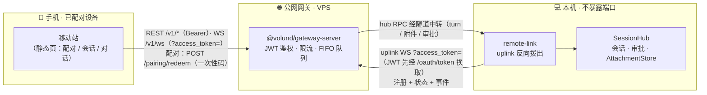

# 远程网关（relay）

远程网关是独立的公网中转进程（`@volund/gateway-server`，**不经 volund CLI**）：
桌面 volund（TUI/Web 控制台）主动向网关拨出 `/uplink` 注册，手机或机器客户端经
网关中转控制**本机**会话（拓扑：手机 → 网关(VPS) → uplink 隧道 → 本机）。
公网实例：`https://gateway.ai-agentic.cc`。

> 部署细节（Docker / Caddy / 域名）见仓库 `deploy/gateway/README.md`。
> 网关是独立的协议面——任何实现网关协议的应用都能对接：帧协议与 REST/WS
> 契约见 `packages/gateway-server/PROTOCOL.md`（TypeScript 帧类型由
> `@volund/gateway-server` 导出）。

## 拓扑



移动站**从不直连本机**——所有 REST/WS 调用都落在网关上，经反向拨出的 uplink
隧道以 hub RPC 帧中转；事件沿同一条隧道回流。附件双向都走隧道：上传经
`POST /v1/attachments` 暂存进本机 AttachmentStore，移动站回放历史图片时经
`GET /v1/attachments/{handle}` 把字节取回。浏览器无法给 WebSocket 握手设请求头，
因此两条 WS 通道（客户端 `/v1/ws` 与本机 `/uplink`）都以 `?access_token=` 查询
参数鉴权。

## 启动（网关侧）

```bash
pnpm build --filter @volund/gateway-server --filter @volund/mobile
node packages/gateway-server/dist/bin.js --port 8788   # 或 GATEWAY_PORT
```

首次启动且无客户端配置时，生成 bootstrap 客户端：明文 client_secret 只在启动输出里
打印一次，`~/.volund/gateway/clients.json`（0600）里只存其域分隔 SHA-256 哈希——老的
明文格式文件在下次启动时自动迁移为哈希。签名密钥缺省生成并持久化在
`~/.volund/gateway/token-key`——删掉它会让所有已签发 token 失效。

## 启动（本机侧）

本机不需要任何额外命令：远程控制随 volund.js（TUI + Web 控制台）一起启动。
在 Web 控制台「远程控制」tab 填网关地址 / client_id / client_secret 并启动服务
（或手写 `~/.volund/config.toml` 的 `[remote]` 段）；起停状态写回 `remote.enabled`，
之后每次启动 volund 自动拨出。

## 认证

```bash
curl -X POST http://127.0.0.1:8788/oauth/token \
  -H 'content-type: application/x-www-form-urlencoded' \
  -d 'grant_type=client_credentials&client_id=REFID_002Q&client_secret=REFID_004Q'
```

返回的 `access_token` 作为 `Authorization: Bearer <token>` 用于全部 `/v1/*` 端点。
本机 uplink 接入的客户端凭证需要 `uplink` scope（bootstrap 客户端默认带）。

## 会话与并发模型

volund 是**单 runner** 运行时：所有 turn 在本机串行执行（FIFO 队列），忙时请求等待
`GATEWAY_QUEUE_TIMEOUT_MS` 后返回 `409 gateway_session_busy`。WS 通道与
chat/completions 共享同一个活动会话；chat/completions 在无活动会话时创建一次性
会话（turn 结束即 detach，响应头 `x-volund-session-id` 可随时恢复）。

## 端点

| 端点                           | 说明                                                  |
| ------------------------------ | ----------------------------------------------------- |
| `POST /oauth/token`            | client_credentials 换 token（form / JSON / Basic 头） |
| `GET /v1/health`               | 健康检查（无需认证）                                  |
| `GET /v1/sessions`             | 可恢复会话清单（经隧道取自本机）                      |
| `POST /v1/chat/completions`    | OpenAI 兼容；`stream: true` 走 SSE                    |
| `POST /v1/attachments`         | 附件上传（原始图片字节 → AttachmentStore handle）     |
| `GET /v1/attachments/{handle}` | 附件字节回放（移动站历史图片回显）                    |
| `GET /v1/ws`                   | WebSocket 交互通道（审批/打断/事件流）                |
| `GET /uplink`                  | 本机反向拨出注册（uplink scope）                      |
| `POST /pairing/redeem`         | 配对码核销 → 移动设备长期 token（IP 限流）            |
| `GET /`（非 API 路径）         | 移动端网站静态托管（同源免 CORS）                     |

### chat/completions 映射

- 只支持文本消息（`content` 为 string 或 `[{type:"text"}]`）；多模态 part 返回
  `400 gateway_unsupported_content`。
- 无 `session_id`：整段消息渲染为逐字稿一次性提交（无状态）。
- 有 `session_id`（扩展字段）：续接既有会话，只取最后一条 user 消息。
- `model` 含 `/` 视为 `provider/model` 全限定 id；别名与裸名在**本机侧**按
  `[models.aliases]` 与本机默认 provider 解析。
- 这是 **agent 调用**：模型在本机执行工具，返回任务完成后的答复；tool_calls
  不回传。turn 因错误中断时返回 `502 gateway_upstream_failed`（SSE 流内错误帧）。

### WebSocket 帧协议

客户端帧：`ping` / `session.start{cwd?}` / `session.resume{id}` / `session.end` /
`turn.submit{prompt, model?}` / `turn.interrupt` / `permission.decide{requestId, kind}`。
服务端帧：`hello` / `event`（core 事件透传）/ 各命令应答 / `error{code, message}`。
浏览器端不能设 `Authorization` 头，用 `?access_token=` 查询参数代替。

## 权限审批

审批在本机侧按桌面权限模式进行：审批卡经隧道同时推到本机 TUI、Web 控制台与手机，
任一端决策全端清卡；无人决策超过 `GATEWAY_PERMISSION_TIMEOUT_MS`（默认 120s）
自动 deny。

## 设备配对

「远程控制」tab 生成一次性配对码（5 分钟有效），手机打开网关地址扫码/输入，
`POST /pairing/redeem` 核销后签发 30 天设备 token（落盘
`~/.volund/gateway/devices.json`）；设备 token 只授 chat scope，撤销即失效。

## 移动站单独部署

移动站默认可由网关同源托管（`VOLUND_MOBILE_ASSET_DIR`）；也可以完全独立部署到
任意静态托管（`deploy/mobile/` 镜像 / CDN）。独立部署时网关侧配置
`GATEWAY_MOBILE_PUBLIC_URL`（配对链接指向移动站并自动携带 `&gw=` 网关地址）与
`GATEWAY_CORS_ORIGINS`（跨源放行移动站 Origin）；移动站把 `gw` 参数写入
localStorage 后跨源直连网关，同源托管形态行为不变。

## 安全面

- token 为 HS256 JWT，强制 iss/exp/签名校验；客户端 secret 常量时间比对；
- `/oauth/token` 每 IP 限流（默认 30/min），`/v1/*` 每客户端限流（默认 600/min）；
- JSON body 4 MiB 上限，WS 消息 1 MiB 上限；客户端帧必须掩码（RFC 6455）；
- CORS 默认关闭，`GATEWAY_CORS_ORIGINS` 显式开白名单；
- 会话 cwd 被关进本机工作区（网关与本机双重 realpath 校验）。
